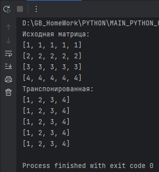
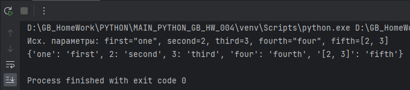
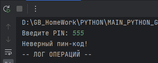
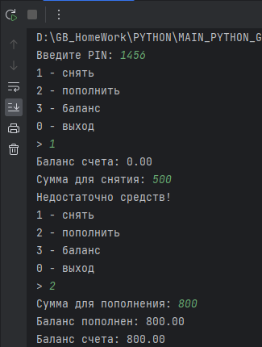
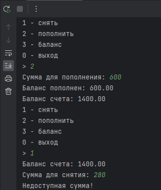
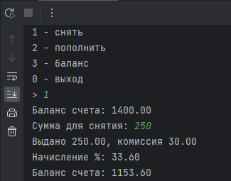
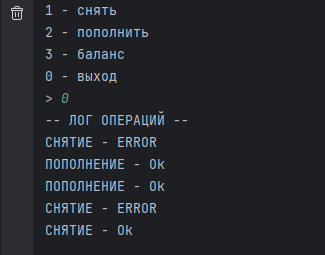

# Погружение в Python. Функции

# Задача 1
Напишите функцию для транспонирования матрицы

Транспонирование — в линейной алгебре это операция над матрицами в результате которой матрица поворачивается
относительно своей главной диагонали. При этом столбцы исходной матрицы становятся строками результирующей.

**пример выполнения**

# Задача 2
Напишите функцию принимающую, на вход только ключевые параметры и возвращающую словарь, 
где ключ - значение переданного аргумента, а значение - имя аргумента. Если ключ не хешируем, 
используйте его строковое представление.

**пример выполнения**

# Задача 3
Возьмите задачу о банкомате из семинара 2. Разбейте её на отдельные операции - функции. 
Дополнительно сохраняйте все операции поступления и снятия средств в список.

